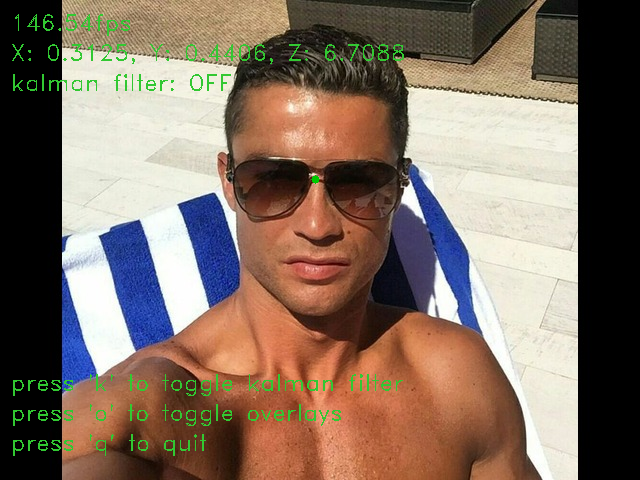

<p align="center">
  
</p>

## What ?

A Python application that captures and processes live video feed to resolve the screen coordinates of the midpoint between the eyes, leveraging OpenCV for processing the captured image frames and MediaPipe for facial feature extraction, providing real-time visual feedback.

## Why ?

It's a core component of a current university project and I wanted to showcase my (elementary) Python skills.

## Features

- **Real-Time Video Capture:** Accesses and processes video feed from an arbitrary device.
- **Facial Landmark Detection:** Employs MediaPipe to extract facial features from each captured frame.
- **Eye Midpoint Computation:** Resolves the screen coordinates of the midpoint between the eyes and overlays it on the video feed.
- **UDP Transmission:** Optionally sends the computed coordinates over UDP to an arbitrary receiver.

## Installation

#### Dependencies

- **Python 3.7 - 3.12.x**
   - Currently, MediaPipe supports up to Python 3.12.x.
- **OpenCV**
- **MediaPipe**

1. **Clone the Repository**

```bash
   git clone https://github.com/Hotz99/python_facetracker.git
   cd python_facetracker
```

2. **Set Up a Virtual Environment**

```bash
   python -m venv venv  
   source venv/bin/activate  *(on Windows: venv\Scripts\activate)*
```

3. **Install Dependencies**
``` bash
   pip install -r requirements.txt
```

## Usage

Run the main script to start the application:

```bash
python main.py
```

A window will open displaying the video feed with the eyes' midpoint marked. Press `q` to exit the application.

Set the `UDP_RECEIVER_IP` and `UDP_RECEIVER_PORT` variables in `main.py` with valid values to enable the transmission of the computed coordinates.